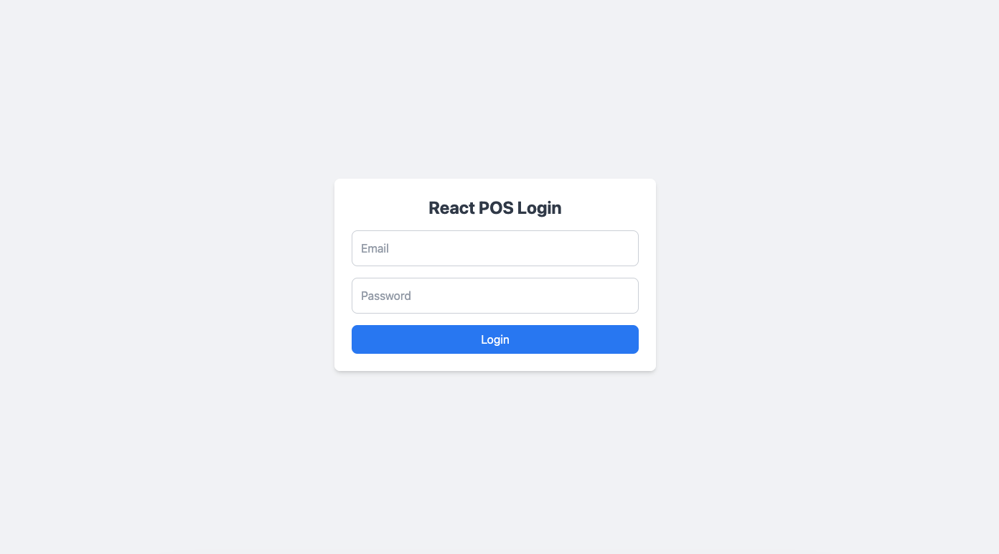
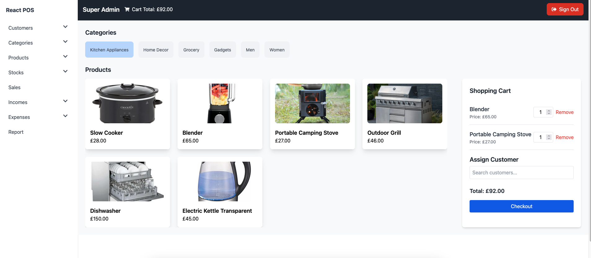
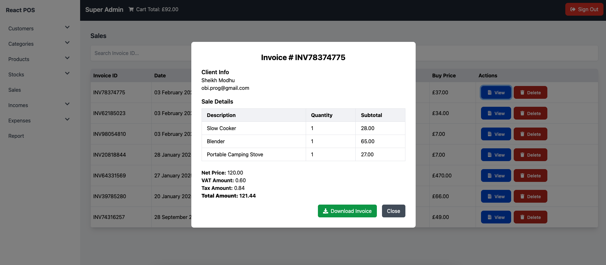
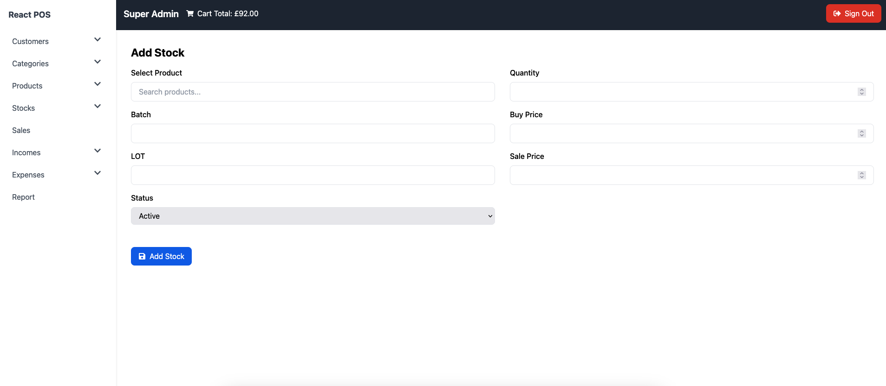
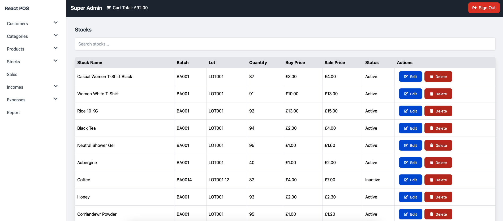
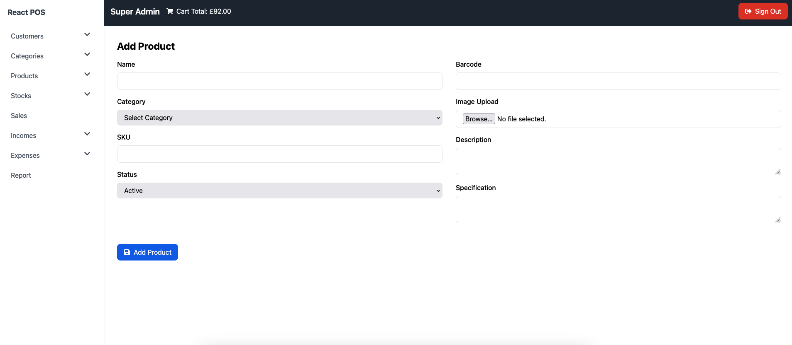
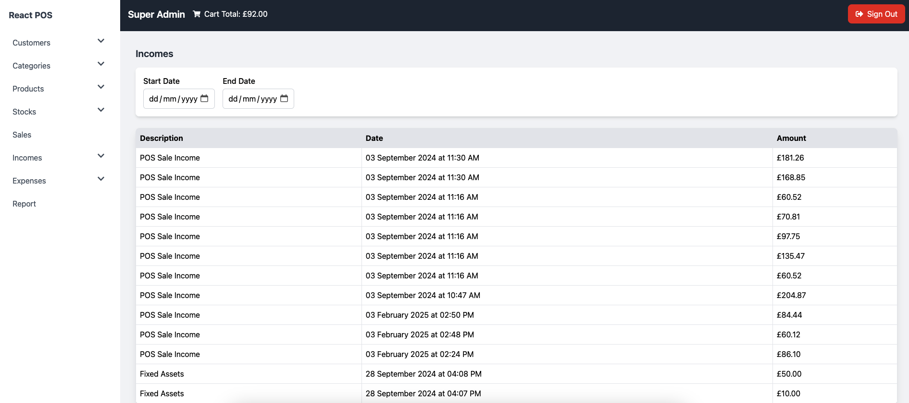
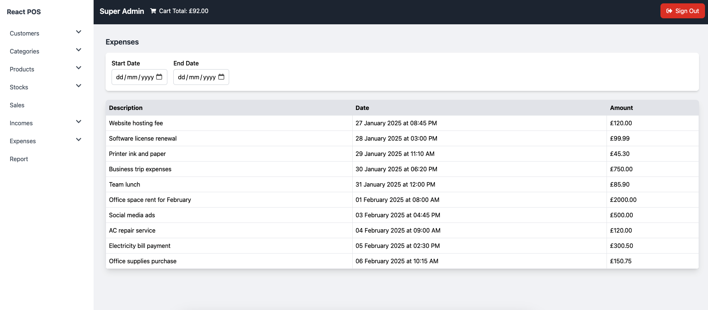
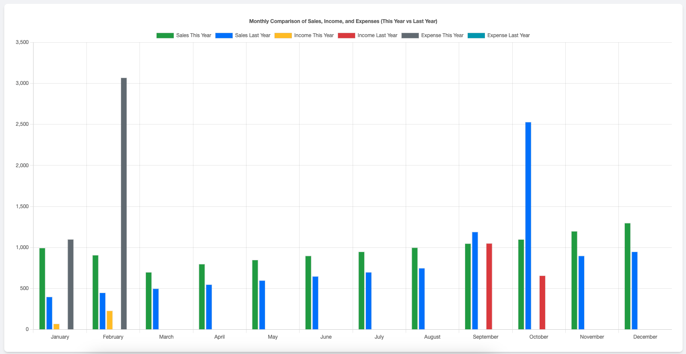

# React Point-of-Sale (POS) System with Laravel API

## Introduction
The React Point-of-Sale (POS) System is a robust and scalable web application designed to streamline sales operations. Built with React.js for the frontend and Laravel API for the backend, the system provides a seamless user experience for managing stocks, categories, customers, and point-of-sales transactions.

## Key Features

### Authentication & Security
- Laravel Sanctum API for secure authentication.
- Secure data handling and API request validation.
- The login module leverages the Laravel Sanctum API for secure user authentication. It integrates seamlessly with a MySQL database to manage user credentials and sessions. Additionally, the API token is stored in localStorage, ensuring a smooth and secure login experience for users.

### Shopping Cart Management
- LocalStorage integration to persist cart data across sessions.
- Add, update, and remove items from the shopping cart dynamically.
- The POS module was developed by gathering category and stock data, enabling stock browsing by category. Users can add selected items to a shopping cart, with quantities increasing by tapping. Additionally, an assigned customer function was included for future data analysis on customer preferences and purchasing patterns.

### Sales Transactions
- Process sales in real-time with an intuitive user interface.
- Automatic stock updates based on sales.
- Detailed transaction history for records and analytics.

### Stock Management
- Add, edit, and delete stock items.
- Real-time updates to stock levels upon sales transactions.
- Stock categorisation for efficient organisation.

- The stock module enables users to add stocks by selecting a category, uploading images, and specifying details such as SKU (Stock Keeping Unit), barcodes, descriptions, and product specifications.

- The stock module is a critical component of the POS application. It allows managing different buying and selling prices for products, which can vary over time. This module helps track multiple instances of the same product with different stock entries to reflect varying prices.

### Product Management
- Manage products and categories dynamically.
- Seamless integration with stock management.

### Income Management
- The income module automatically calculates income when sales occur by subtracting the buying price from the selling price. The calculated income is then stored in the income module.

### Expense Tracking
- The expenses module is designed to track various shop expenses such as salaries and rent. All expense records are stored in this module.

### Reports Module
The Reports Module in the POS system provides a comprehensive comparison of sales, income, and expenses between the current and previous years. This module is essential for business analysis, allowing users to track financial performance over time and make data-driven decisions.

#### Yearly Comparison of Sales, Income, and Expenses
- The system visualises monthly financial data using bar charts, making it easy to compare this year’s performance with last year’s figures. Sales data is displayed for both the current and previous years, enabling businesses to assess growth trends.

#### Visual Representation with Bar Charts
- The module utilises bar charts to illustrate key financial metrics.
- Different colours represent distinct categories:
  - **Green**: Sales This Year
  - **Blue**: Sales Last Year
  - **Yellow**: Income This Year
  - **Red**: Income Last Year
  - **Grey**: Expense This Year
  - **Teal**: Expense Last Year

#### Monthly Data Breakdown
- Users can view individual months to see variations in income and expenses.
- This allows businesses to identify profitable months, spot anomalies, and adjust financial strategies accordingly.

#### Business Performance Analysis
- By comparing income and expenses, businesses can evaluate net profit trends.
- The module helps in forecasting and identifying cost-saving opportunities.

#### Technical Implementation
- The module retrieves financial data from the database and processes it for visualisation.
- Data is structured dynamically to accommodate future financial records.

#### Impact on Business Operations
- Provides quick insights into business performance.
- Helps in making informed decisions regarding cost management and revenue strategies.
- Enables businesses to plan for future financial growth based on historical trends.

## Technology Stack
### Frontend:
- React.js (Optimised for performance and scalability)
- Tailwind CSS (Modern UI styling for a clean and professional look)
- Axios (Handling API requests securely and efficiently)
- Context API (State management for project configuration)

### Backend:
- Laravel 11 (Powerful PHP framework for API development)
- Laravel Sanctum (Authentication and security)
- MySQL (Reliable database for storing POS data)
- Eloquent ORM (Efficient database management and queries)

## Why This Project is Valuable
### Business Impact:
- Simplifies inventory and sales management for small to medium-sized businesses.
- Enhances efficiency by reducing manual record-keeping and errors.

### Technical Excellence:
- Showcases expertise in React.js, Laravel, RESTful API development, and authentication mechanisms.
- Implements best practices for scalability, security, and user-friendly UI/UX.

## Future Enhancements
- Role-based access control (RBAC) for multi-user management.
- Cloud deployment for better scalability and accessibility.
- Integration with payment gateways for seamless transactions.

## Conclusion
The React POS System demonstrates my ability to develop scalable, secure, and efficient web applications using modern technologies. This project reflects my expertise in React, Laravel, RESTful API development, authentication, and database management. I am eager to contribute my skills to your organisation and take on new challenges in the field of Full-Stack Web Development.

For more details, please visit the GitHub repository: [React POS System](https://github.com/skarnov/react-pos/)